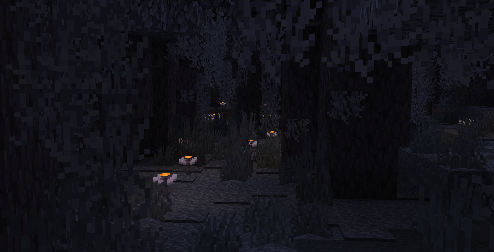

## Glowing Eyeblossom

Works better when installed on both the server and the client

[CurseForge](https://www.curseforge.com/minecraft/mc-mods/glowing-eyeblossom), [Modrinth](https://modrinth.com/mod/glowing-eyeblossom)

[Discord](https://discord.gg/UY4nhvUzaK)

### Light level
- Open Eyeblossom: 4
- Open Eyeblossom in the pot: 13
- Closed Eyeblossom: 1
- Closed Eyeblossom in the pot: 3

### Config
You can change the light level of the Eyeblossom in the config file.  
The config file is located in the `<game directory>/config/GlowingEyeblossom/main.conf`.

