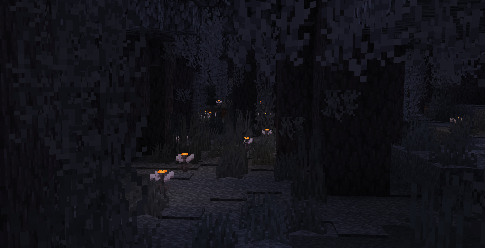

## Glowing Eyeblossom

Makes the Eyeblossom emit light. Available for Fabric [1.20.4+] and NeoForge [26.2+].

Works better when installed on both the server and the client

[CurseForge](https://www.curseforge.com/minecraft/mc-mods/glowing-eyeblossom), [Modrinth](https://modrinth.com/mod/glowing-eyeblossom)

[Discord](https://discord.gg/UY4nhvUzaK)

Also check out [Glowing Torchflower](https://github.com/NikitaCartes/Glowing-Torchflower) mod!

### Light level
- Open Eyeblossom: 4
- Open Eyeblossom in the pot: 13
- Closed Eyeblossom: 1
- Closed Eyeblossom in the pot: 3

### Config
You can change the light level of the Eyeblossom in the config file, located at
`<game directory>/config/GlowingEyeblossom/main.conf`.

| Option                                   | Default | Description                       |
|------------------------------------------|---------|-----------------------------------|
| `open-eyeblossom-brightness`             | 4       | Open eyeblossom                   |
| `closed-eyeblossom-brightness`           | 1       | Closed eyeblossom                 |
| `open-eyeblossom-flowerpot-brightness`   | 13      | Open eyeblossom in a flower pot   |
| `closed-eyeblossom-flowerpot-brightness` | 3       | Closed eyeblossom in a flower pot |

Values are light levels from 0 (dark) to 15 (brightest).

